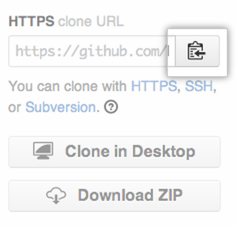

# Lab Instructions

<!--TOC-->

## Lab Overview
1. Create a GitHub account.
2. Fork the class repo
3. Copy the project skeleton into Lab_1
4. Create a "Hello World" page in PHP
5. Commit and Push your code
6. Email me a link to your Repository
7. Profit!!!!

## How to Fork the Class Repo

### Fork a Repo
A fork is a copy of a repository. Forking a repository allows you to freely experiment with changes without affecting the original project. Most commonly, forks are used to either propose changes to someone else's project or to use someone else's project as a starting point for your own idea.
It this class, I will give you the base code for your projects as updates to the class repo.

### Fork an example repository

Forking a repository is a simple two-step process. We've created a repository for you to practice with!

1. On GitHub, navigate to the [ProfLevin/CIS1152](https://github.com/ProfLevin/CIS1152) repository.
2. In the top-right corner of the page, click Fork.


That's it! Now, you have a fork of the original [ProfLevin/CIS1152](https://github.com/ProfLevin/CIS1152) repository.

### Keep your fork synced

You might fork a project in order to propose changes to the upstream, or original, repository. In this case, it's good practice to regularly sync your fork with the upstream repository. To do this, you'll need to use Git on the command line. You can practice setting the upstream repository using the same ProfLevin/CIS1152 repository you just forked!

#### Step 1: Set Up Git

If you haven't yet, you should first set up Git. Don't forget to set up authentication to GitHub from Git as well.

#### Step 2: Create a local clone of your fork

Right now, you have a fork of the CIS1152 repository, but you don't have the files in that repository on your computer. Let's create a clone of your fork locally on your computer.

On GitHub, navigate to your fork of the CIS1152 repository.



In the right sidebar of your fork's repository page, click  to copy the clone URL for your fork.
Open Terminal (for Mac and Linux users) or the command line (for Windows users).
Type `git clone`, and then paste the URL you copied in Step 2. It will look like this, with your GitHub username instead of YOUR-USERNAME:

```bash
git clone https://github.com/YOUR-USERNAME/CIS1152
```

Press Enter. Your local clone will be created.

```bash
git clone https://github.com/YOUR-USERNAME/CIS1152
# Cloning into `CIS1152`...
# remote: Counting objects: 10, done.
# remote: Compressing objects: 100% (8/8), done.
# remove: Total 10 (delta 1), reused 10 (delta 1)
# Unpacking objects: 100% (10/10), done.
```

Now, you have a local copy of your fork of the CIS1152 repository!

####Step 3: Configure Git to sync your fork with the original CIS1152 repository

When you fork a project in order to propose changes to the original repository, you can configure Git to pull changes from the original, or upstream, repository into the local clone of your fork.

1. On GitHub, navigate to the ProfLevin/CIS1152 repository.
2. In the right sidebar of the repository page, click  to copy the clone URL for the repository.
3. Open Terminal (for Mac and Linux users) or the command line (for Windows users).
4. Change directories to the location of the fork you cloned in Step 2: Create a local clone of your fork.
    - To go to your home directory, type just `cd`  with no other text on Linux and Mac or type `cd %HOMEPATH%` on Windows.
    - To list the files and folders in your current directory, type `ls` on Mac and Linux or `dir` on Windows.
    - To go into one of your listed directories, type `cd your_listed_directory`.
    - To go up one directory, type `cd ..`.

5. Type `git remote -v` and press Enter. You'll see the current configured remote repository for your fork.

    ```bash
    git remote -v
    # origin  https://github.com/YOUR_USERNAME/YOUR_FORK.git (fetch)
    # origin  https://github.com/YOUR_USERNAME/YOUR_FORK.git (push)
    ```

6. Type `git remote add upstream`, and then paste the URL you copied in Step 2 and press Enter. It will look like this:

    ```bash
    git remote add upstream https://github.com/ProfLevin/CIS1152.git
    ```

7. To verify the new upstream repository you've specified for your fork, type `git remote -v` again. You should see the URL for your fork as origin, and the URL for the original repository as upstream.

    ```bash
    git remote -v
    # origin    https://github.com/YOUR_USERNAME/YOUR_FORK.git (fetch)
    # origin    https://github.com/YOUR_USERNAME/YOUR_FORK.git (push)
    # upstream  https://github.com/ORIGINAL_OWNER/ORIGINAL_REPOSITORY.git (fetch)
    # upstream  https://github.com/ORIGINAL_OWNER/ORIGINAL_REPOSITORY.git (push)
    ```

Now, you can keep your fork synced with the upstream repository with a few Git commands.

#### Step 4: Syncing Your Fork
Sync a fork of a repository to keep it up-to-date with the upstream repository.

1. Open Terminal (for Mac and Linux users) or the command line (for Windows users).
2. Change the current working directory to your local project.
3. Fetch the branches and their respective commits from the upstream repository. Commits to master will be stored in a local branch, upstream/master.

    ```bash
    git fetch upstream
    # remote: Counting objects: 75, done.
    # remote: Compressing objects: 100% (53/53), done.
    # remote: Total 62 (delta 27), reused 44 (delta 9)
    # Unpacking objects: 100% (62/62), done.
    # From https://github.com/ORIGINAL_OWNER/ORIGINAL_REPOSITORY
    #  * [new branch]      master     -> upstream/master
    ```

4. Check out your fork's local master branch.

    ```bash
    git checkout master
    # Switched to branch 'master'
    ```

5. Merge the changes from upstream/master into your local master branch. This brings your fork's master branch into sync with the upstream repository, without losing your local changes.
    ```bash
    git merge upstream/master
    # Updating a422352..5fdff0f
    # Fast-forward
    #  README                    |    9 -------
    #  README.md                 |    7 ++++++
    #  2 files changed, 7 insertions(+), 9 deletions(-)
    #  delete mode 100644 README
    #  create mode 100644 README.md
    ```
If your local branch didn't have any unique commits, Git will instead perform a "fast-forward":

```bash
git merge upstream/master
# Updating 34e91da..16c56ad
# Fast-forward
# README.md                 |    5 +++--
# 1 file changed, 3 insertions(+), 2 deletions(-)
```
